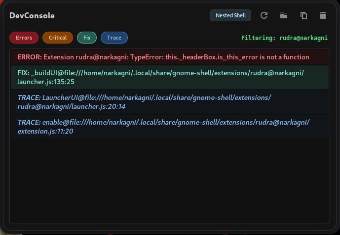
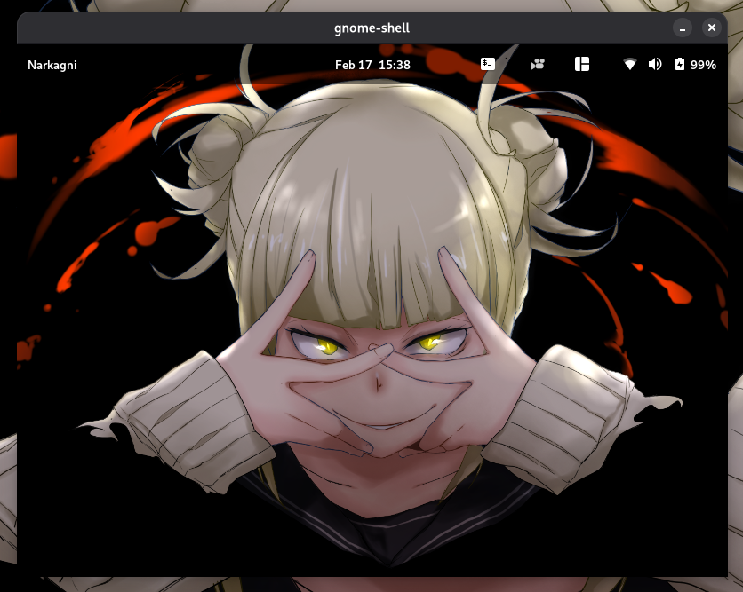
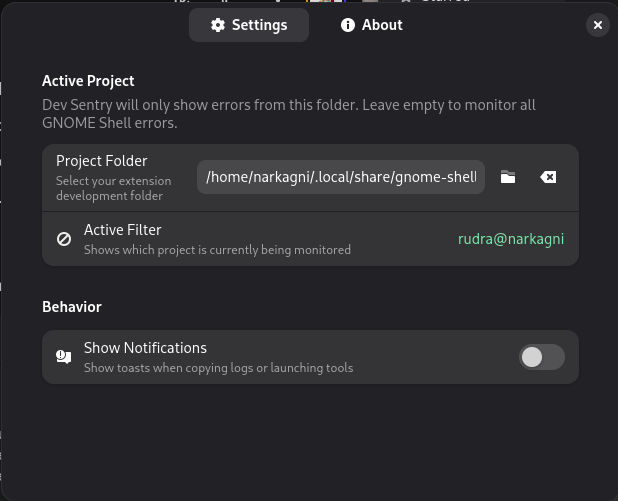

  
  <h1>Dev Sentry</h1>
  
<strong>The Ultimate Debugging Companion for GNOME Shell Extension Developers</strong>

  
Developed by <strong>Narkagni</strong>

<h2>Overview</h2>

  Dev Sentry is a specialized GNOME Shell extension designed to streamline the workflow of extension developers. 
  It eliminates the need to constantly switch between terminals and the GUI by bringing logs, debugging tools, 
  and shell management directly into the top panel.

<h2>Gallery</h2>

  <strong>The Main Panel:</strong> Real-time log streaming with color-coded errors.

  

 

  <strong>Nested Shell & Preferences:</strong> Launch a nested instance for safe testing and filter logs by project path.

  
  

<h2>Key Features</h2>

  
<strong>Real-Time Log Streaming</strong>

  

    Dev Sentry streams logs directly from <code>journalctl</code>. It explicitly filters out system noise and categorizes entries:
  

  <ul>
    <li><strong>JS ERROR:</strong> Standard JavaScript errors in your code.</li>
    <li><strong>CRITICAL:</strong> Gjs and GNOME Shell critical warnings.</li>
    <li><strong>TRACE:</strong> Stack traces and custom log messages.</li>
  </ul>

  
<strong>One-Click "Fix" (VS Code Integration)</strong>

  

    When an error occurs, Dev Sentry parses the stack trace to find the file path and line number. 
    Clicking the error row in the panel immediately opens <strong>VS Code</strong> at the exact line 
    where the crash happened.
  

  
<strong>Nested Shell Launcher</strong>

  

    Test your changes safely without logging out. The panel includes a dedicated button to launch a 
    <strong>Nested GNOME Shell</strong> instance within a window (Wayland supported). This allows for rapid 
    iteration cycles and prevents freezing your main user session.
  

  
<strong>Smart Project Filtering</strong>

  

    Working on multiple extensions simultaneously? In the preferences, you can set your active 
    <strong>Project Folder</strong>. Dev Sentry will monitor the UUID of that folder and filter the 
    stream to show only logs and errors originating from that specific extension.
  

<h2>Installation</h2>

<h3>Requirements</h3>
<ul>
  <li>GNOME Shell 45 - 49</li>
  <li><code>libglib2.0-bin</code> (Required for schema compilation)</li>
  <li>VS Code (Recommended for the Click-to-Fix feature)</li>
</ul>

<h3>Install from Source</h3>

<strong>1. Clone the repository</strong>

<pre>
git clone https://github.com/NarkAgni/dev-sentry.git
cd dev-sentry
</pre>

<strong>2. Install using Make</strong>

<pre>
make install
</pre>

<strong>3. Restart GNOME Shell</strong>

For X11: Press <code>Alt+F2</code>, type <code>r</code>, and hit Enter. 
For Wayland: Log out and log back in.

<strong>4. Enable the extension</strong>

<pre>
gnome-extensions enable dev-sentry@narkagni
</pre>

<h2>Support Development</h2>

  Dev Sentry is open-source and free. If this tool helps you debug faster and saves you time, 
  consider supporting the development.

  
  &nbsp;&nbsp;
  

 

  
<strong>Crypto Addresses</strong>

   
  
<strong>Bitcoin (BTC):</strong>

  <pre>1GSHkxfhYjk1Qe4AQSHg3aRN2jg2GQWAcV</pre>

  
<strong>Ethereum (ETH):</strong>

  <pre>0xf43c3f83e53495ea06676c0d9d4fc87ce627ffa3</pre>

  
<strong>ThtherUS (USDT):</strong>

  <pre>THnqG9nchLgaf1LzGK3CqdmNpRxw59hs82</pre>

  License: GPL-3.0
